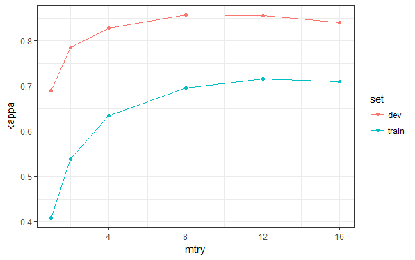
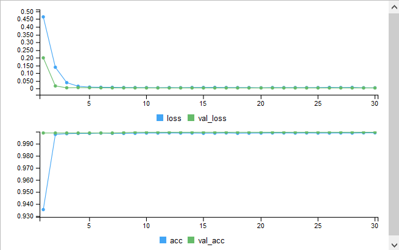

2018-05-02 - Credit Card Fraud
================
Alex Pan

-   [1. Libraries](#libraries)
    -   [Libraries](#libraries-1)
    -   [Session Info](#session-info)
    -   [Custom Functions](#custom-functions)
-   [2. Load in Data](#load-in-data)
    -   [Data structure and Descriptive Stats:](#data-structure-and-descriptive-stats)
    -   [Missingness](#missingness)
-   [3. Descriptive Stats](#descriptive-stats)
-   [4. Data Partitioning](#data-partitioning)
    -   [Controls for model validation](#controls-for-model-validation)
-   [5. Dealing with Unbalanced Classes:](#dealing-with-unbalanced-classes)
    -   [5.1. Undersampling](#undersampling)
    -   [5.2. Oversampling](#oversampling)
    -   [5.3 SMOTE](#smote)
    -   [5.4 SMOTE v 2](#smote-v-2)
    -   [5.5 No Sampling](#no-sampling)
-   [6. Classification](#classification)
    -   [6.1 Over Sampling](#over-sampling)
    -   [6.2. No Sampling](#no-sampling-1)
-   [7. Testing](#testing)
    -   [7.2.1 No Sampling, Neural Network](#no-sampling-neural-network)

A tour of classification algorithms to detect credit card fraud, primarily using the caret package.

Data from <a href = https://www.kaggle.com/mlg-ulb/creditcardfraud/data>Kaggle</a>.

1. Libraries
------------

### Libraries

``` r
set.seed(123456)

library(tidyverse)
theme_set(theme_bw())
library(keras)
library(tensorflow)
tf$set_random_seed(123456)
library(caret)    # Note: needs to be loaded in after tensorflow
library(gridExtra)
library(DMwR)
```

### Session Info

``` r
sessionInfo()
```

    R version 3.5.0 (2018-04-23)
    Platform: x86_64-w64-mingw32/x64 (64-bit)
    Running under: Windows 10 x64 (build 16299)

    Matrix products: default

    locale:
    [1] LC_COLLATE=English_Canada.1252  LC_CTYPE=English_Canada.1252   
    [3] LC_MONETARY=English_Canada.1252 LC_NUMERIC=C                   
    [5] LC_TIME=English_Canada.1252    

    attached base packages:
    [1] grid      stats     graphics  grDevices utils     datasets  methods  
    [8] base     

    other attached packages:
     [1] DMwR_0.4.1      gridExtra_2.3   caret_6.0-79    lattice_0.20-35
     [5] tensorflow_1.5  keras_2.1.6     forcats_0.3.0   stringr_1.3.0  
     [9] dplyr_0.7.4     purrr_0.2.4     readr_1.1.1     tidyr_0.8.0    
    [13] tibble_1.4.2    ggplot2_2.2.1   tidyverse_1.2.1

    loaded via a namespace (and not attached):
     [1] nlme_3.1-137       bitops_1.0-6       xts_0.10-2        
     [4] lubridate_1.7.4    dimRed_0.1.0       httr_1.3.1        
     [7] rprojroot_1.3-2    tools_3.5.0        backports_1.1.2   
    [10] R6_2.2.2           KernSmooth_2.23-15 rpart_4.1-13      
    [13] lazyeval_0.2.1     colorspace_1.3-2   nnet_7.3-12       
    [16] withr_2.1.2        tidyselect_0.2.4   mnormt_1.5-5      
    [19] curl_3.2           compiler_3.5.0     cli_1.0.0         
    [22] rvest_0.3.2        xml2_1.2.0         caTools_1.17.1    
    [25] scales_0.5.0       sfsmisc_1.1-2      DEoptimR_1.0-8    
    [28] psych_1.8.3.3      robustbase_0.93-0  tfruns_1.3        
    [31] digest_0.6.15      foreign_0.8-70     rmarkdown_1.9     
    [34] base64enc_0.1-3    pkgconfig_2.0.1    htmltools_0.3.6   
    [37] TTR_0.23-3         rlang_0.2.0        readxl_1.1.0      
    [40] ddalpha_1.3.3      quantmod_0.4-13    rstudioapi_0.7    
    [43] bindr_0.1.1        zoo_1.8-1          jsonlite_1.5      
    [46] gtools_3.5.0       ModelMetrics_1.1.0 magrittr_1.5      
    [49] Matrix_1.2-14      Rcpp_0.12.16       munsell_0.4.3     
    [52] abind_1.4-5        reticulate_1.7     stringi_1.1.7     
    [55] whisker_0.3-2      yaml_2.1.18        MASS_7.3-49       
    [58] gplots_3.0.1       plyr_1.8.4         recipes_0.1.2     
    [61] gdata_2.18.0       parallel_3.5.0     crayon_1.3.4      
    [64] haven_1.1.1        splines_3.5.0      hms_0.4.2         
    [67] zeallot_0.1.0      knitr_1.20         pillar_1.2.2      
    [70] reshape2_1.4.3     codetools_0.2-15   stats4_3.5.0      
    [73] CVST_0.2-1         magic_1.5-8        glue_1.2.0        
    [76] evaluate_0.10.1    modelr_0.1.1       foreach_1.4.4     
    [79] cellranger_1.1.0   gtable_0.2.0       kernlab_0.9-26    
    [82] assertthat_0.2.0   DRR_0.0.3          gower_0.1.2       
    [85] prodlim_2018.04.18 broom_0.4.4        class_7.3-14      
    [88] survival_2.41-3    geometry_0.3-6     timeDate_3043.102 
    [91] RcppRoll_0.2.2     iterators_1.0.9    bindrcpp_0.2.2    
    [94] lava_1.6.1         ROCR_1.0-7         ipred_0.9-6       

### Custom Functions

``` r
# Chosen at random
test.class <- function(model, test=credit_dev, cl=credit_dev$Class, positive = "1") {
    # Given a model 'model', predicts the test classifier. Then returns a confusion matrix for the test data.
    # Model = A model object (ex., glm, random forest, knn)
    # test = data.frame containing all the variables used in the model
    # cl = A factor of the true classifications for the variable of interest in 'test'
    # positive = Which outcome is the outcome of interest? By default, it is 1.
   predict <- predict(model, test)
   return(confusionMatrix(predict, cl, positive = positive))
}

scaleFUN <- function(x) sprintf("%.2f", x)
```

2. Load in Data
---------------

These data are all PCA variables (i.e., these are not the actual variables)

### Data structure and Descriptive Stats:

``` r
glimpse(credit)
```

    Observations: 284,807
    Variables: 31
    $ Time   <int> 0, 0, 1, 1, 2, 2, 4, 7, 7, 9, 10, 10, 10, 11, 12, 12, 1...
    $ V1     <dbl> -1.359807, 1.191857, -1.358354, -0.966272, -1.158233, -...
    $ V2     <dbl> -0.0727812, 0.2661507, -1.3401631, -0.1852260, 0.877736...
    $ V3     <dbl> 2.5363467, 0.1664801, 1.7732093, 1.7929933, 1.5487178, ...
    $ V4     <dbl> 1.3781552, 0.4481541, 0.3797796, -0.8632913, 0.4030339,...
    $ V5     <dbl> -0.3383208, 0.0600176, -0.5031981, -0.0103089, -0.40719...
    $ V6     <dbl> 0.4623878, -0.0823608, 1.8004994, 1.2472032, 0.0959215,...
    $ V7     <dbl> 0.2395986, -0.0788030, 0.7914610, 0.2376089, 0.5929407,...
    $ V8     <dbl> 0.09869790, 0.08510165, 0.24767579, 0.37743587, -0.2705...
    $ V9     <dbl> 0.3637870, -0.2554251, -1.5146543, -1.3870241, 0.817739...
    $ V10    <dbl> 0.0907942, -0.1669744, 0.2076429, -0.0549519, 0.7530744...
    $ V11    <dbl> -0.5515995, 1.6127267, 0.6245015, -0.2264873, -0.822842...
    $ V12    <dbl> -0.6178009, 1.0652353, 0.0660837, 0.1782282, 0.5381956,...
    $ V13    <dbl> -0.9913898, 0.4890950, 0.7172927, 0.5077569, 1.3458516,...
    $ V14    <dbl> -0.3111694, -0.1437723, -0.1659459, -0.2879237, -1.1196...
    $ V15    <dbl> 1.46817697, 0.63555809, 2.34586495, -0.63141812, 0.1751...
    $ V16    <dbl> -0.4704005, 0.4639170, -2.8900832, -1.0596472, -0.45144...
    $ V17    <dbl> 0.20797124, -0.11480466, 1.10996938, -0.68409279, -0.23...
    $ V18    <dbl> 0.0257906, -0.1833613, -0.1213593, 1.9657750, -0.038194...
    $ V19    <dbl> 0.4039930, -0.1457830, -2.2618571, -1.2326220, 0.803486...
    $ V20    <dbl> 0.2514121, -0.0690831, 0.5249797, -0.2080378, 0.4085424...
    $ V21    <dbl> -0.0183068, -0.2257752, 0.2479982, -0.1083005, -0.00943...
    $ V22    <dbl> 0.2778376, -0.6386720, 0.7716794, 0.0052736, 0.7982785,...
    $ V23    <dbl> -0.11047391, 0.10128802, 0.90941226, -0.19032052, -0.13...
    $ V24    <dbl> 0.0669281, -0.3398465, -0.6892810, -1.1755753, 0.141267...
    $ V25    <dbl> 0.1285394, 0.1671704, -0.3276418, 0.6473760, -0.2060096...
    $ V26    <dbl> -0.1891148, 0.1258945, -0.1390966, -0.2219288, 0.502292...
    $ V27    <dbl> 0.1335584, -0.0089831, -0.0553528, 0.0627228, 0.2194222...
    $ V28    <dbl> -0.02105305, 0.01472417, -0.05975184, 0.06145763, 0.215...
    $ Amount <dbl> 149.62, 2.69, 378.66, 123.50, 69.99, 3.67, 4.99, 40.80,...
    $ Class  <fct> 0, 0, 0, 0, 0, 0, 0, 0, 0, 0, 0, 0, 0, 0, 0, 0, 0, 0, 0...

------------------------------------------------------------------------

### Missingness

There is one missing entry for Time. It's a non-fraud entry and it's one of 200,000--I'm just going to remove it.

``` r
colSums(is.na(credit))
```

      Time     V1     V2     V3     V4     V5     V6     V7     V8     V9 
         1      0      0      0      0      0      0      0      0      0 
       V10    V11    V12    V13    V14    V15    V16    V17    V18    V19 
         0      0      0      0      0      0      0      0      0      0 
       V20    V21    V22    V23    V24    V25    V26    V27    V28 Amount 
         0      0      0      0      0      0      0      0      0      0 
     Class 
         0 

``` r
credit <- na.omit(credit)
```

------------------------------------------------------------------------

3. Descriptive Stats
--------------------

These data are composed of anonymized variables that have been reduced by PCA. For that reason descriptive stats aren't as important to us as they would normally be, since we have absolutely no way of interpreting them.

Most transactions are very small, but some are very large. Larger transactions *may* be more associated with fraud.

``` r
summary(credit$Amount)
```

       Min. 1st Qu.  Median    Mean 3rd Qu.    Max. 
        0.0     5.6    22.0    88.3    77.2 25691.2 

``` r
p1 <- ggplot(credit) +
    aes(x = Amount) +
    geom_histogram()

p2 <- ggplot(credit) +
    aes(x = Amount) +
    stat_ecdf()

grid.arrange(p1, p2, ncol = 2)
```


Time is described as *Number of seconds elapsed between each transaction (over two days)*. I'm not 100% clear on what this means, but judging from the bimodal pattern plotted below I would suspect that data collection began around midnight and continued for 48 hours.

This is interesting because if fraud is more common at certain times of the day, we should really change this feature to 'represent time of day' rather than 'seconds since start'

``` r
p1 <- ggplot(credit) +
    aes(x = Time) +
    geom_histogram() +
    scale_x_continuous(minor_breaks = seq(0, 180000, 3600))

p2 <- ggplot(credit) +
    aes(x = Time) +
    stat_ecdf()

grid.arrange(p1, p2, ncol = 2)
```


------------------------------------------------------------------------

In fact, let's make a new feature now. There are a few ways to split this up--looking only at time of day, or assigning each time a score based on how many other transactions are happening around that time. E.g., breaking up transactions into 10 or 30 minute blocks and making a new variable that describes how many transactions took place in that period.

For simplicity I will just use 'time of day', which atleast roughly increases as 'time of day' increases.

If fraud is actually associated with Time it will *probably* be non-monotonic (eg., more active at very early and very late time rather than trending up or down as 'time of day' increases). For that reason a non-linear classifier would probably do better if Time is important.

``` r
credit <- credit %>%
    mutate(time_of_day = ifelse(Time < 86400, Time / 3600, (Time - 86400) / 3600))

ggplot(credit) +
    aes(x = time_of_day) +
    geom_histogram() +
    scale_x_continuous(minor_breaks = seq(0, 180000, 3600))
```


------------------------------------------------------------------------

4. Data Partitioning
--------------------

1 is credit card fraud, 0 is a normal transaction.

Only 0.2% (492) of the entries are actual fraud! We will need to take special approaches to handle these unbalanced data.

``` r
summary(credit$Class)    
```

         0      1 
    284314    492 

------------------------------------------------------------------------

We start by sampling data for each of the training, CV (development), and test sets. We will then undersample the non-fraud cases.

caret's `createDataPartition` function works like `sample` in base R, except it makes sure that the response variable is balanced across the different data sets. This is especially important when the number of "events" is low.

``` r
mask_train <- createDataPartition(credit$Class, p = 0.7, list = F)
credit_train <- credit[mask_train, ]

# Split the remaining 30% into CV and test sets. Unfortunately this is a convoluted process
mask_cv <- createDataPartition(credit$Class[-mask_train], p = 0.5, list = F)
credit_dev <- credit[mask_cv, ]
credit_test <- credit[-mask_train, ][-mask_cv, ]
```

#### Controls for model validation

Define the controls for each model fit. Here I'm using 5x5-fold CV.

``` r
fit.controls <- trainControl(method = "repeatedcv",    # Bootstrapped CV
                             number = 5,    # number of CV
                             repeats = 5)    # number of repeats
```

5. Dealing with Unbalanced Classes:
-----------------------------------

I'm going to try and figure out which sampling methods are best for these data. For each sampling technique I will use some fairly generic random forests. If any sampling techniques seem to work better than others I will follow up on those specifically and try out other classifiers.

*(Note: For faster Rmarkdown rendering I've disabled the evaluation of the code and am just copying the output from the console)*

**Summary:**

-   Oversampling, SMOTE, and even no sampling perform much better on the dev set compared to undersampling.

-   Oversampling and No sampling produced the highest kappas in these random forest models. Unlike SMOTE and undersampling the training errors are somewhat reflective of the dev set errors, which make them more useful sampling techniques to train models on.

-   Whereas undersampling, oversampling, and SMOTE tended to overfit the training data, no sampling performed better in the dev set compared to the training set. I'm not completely sure why this is the case. (a) I could be under-trained (this will be determined later); or (b) there may be overlap between positive and negative events in the training set that precludes very high training Kappa, whereas the dev set is more sparse (?).

-   Running the sampling *inside* of cross-validation might improve the agreement between the training metrics and dev metrics.

I will move forward using oversampling, SMOTE, and no sampling and try some other classification models.

### 5.1. Undersampling

Undersampling involves censoring a large amount of data.

``` r
## Note I am excluding 'Time' and 'Amount'

credit_train_downsampled <- downSample(x = subset(credit_train, select = -Class),
                               y = credit_train$Class)

summary(credit_train_downsampled$Class)
```

      0   1 
    345 345 

``` r
model_automate_rf <- function(data_, 
                              m_try = c(1, 2, 4, 8, 12, 16), 
                              fit_controls = fit.controls){
    kappas = data.frame(mtry = NA, set = NA, kappa = NA)
    
    for (mtry in m_try){
        fit_rf <- train(Class ~ . -Time,
                        data = data_,
                        method = 'rf',
                        trControl = fit_controls,
                        tuneGrid = expand.grid(mtry = mtry),
                        n.trees = 3001,
                        metric = 'Kappa')
        
        fit_metrics = test.class(fit_rf)
        kappas = rbind(kappas, c(mtry, 'train', fit_rf$results$Kappa))
        kappas = rbind(kappas, c(mtry, 'dev', fit_metrics$overall['Kappa']))
        print(paste('mtry: ', mtry))
        print(fit_rf$results$Kappa)
        print(fit_metrics)
    }
    
    kappas = kappas %>%
        na.omit() %>%
        mutate(kappa = as.numeric(kappa),
               mtry = as.numeric(mtry))
    
    p1 <- ggplot(kappas) +
        aes(x = mtry, y = kappa, col = set) +
        geom_point() +
        geom_line() +
        scale_y_continuous(labels = scaleFUN)
    
    return(p1)
}
```

``` r
model_automate_rf(credit_train_downsampled)
```


    1] "mtry:  1"
    [1] 0.876
    Confusion Matrix and Statistics

              Reference
    Prediction     0     1
             0 42043     4
             1   584    90
                                            
                   Accuracy : 0.986         
                     95% CI : (0.985, 0.987)
        No Information Rate : 0.998         
        P-Value [Acc > NIR] : 1             
                                            
                      Kappa : 0.231         
     Mcnemar's Test P-Value : <2e-16        
                                            
                Sensitivity : 0.95745       
                Specificity : 0.98630       
             Pos Pred Value : 0.13353       
             Neg Pred Value : 0.99990       
                 Prevalence : 0.00220       
             Detection Rate : 0.00211       
       Detection Prevalence : 0.01578       
          Balanced Accuracy : 0.97187       
                                            
           'Positive' Class : 1             
                                            
    [1] "mtry:  2"
    [1] 0.88
    Confusion Matrix and Statistics

              Reference
    Prediction     0     1
             0 41978     3
             1   649    91
                                            
                   Accuracy : 0.985         
                     95% CI : (0.984, 0.986)
        No Information Rate : 0.998         
        P-Value [Acc > NIR] : 1             
                                            
                      Kappa : 0.215         
     Mcnemar's Test P-Value : <2e-16        
                                            
                Sensitivity : 0.96809       
                Specificity : 0.98477       
             Pos Pred Value : 0.12297       
             Neg Pred Value : 0.99993       
                 Prevalence : 0.00220       
             Detection Rate : 0.00213       
       Detection Prevalence : 0.01732       
          Balanced Accuracy : 0.97643       
                                            
           'Positive' Class : 1             
                                            
    [1] "mtry:  4"
    [1] 0.891
    Confusion Matrix and Statistics

              Reference
    Prediction     0     1
             0 41838     2
             1   789    92
                                           
                   Accuracy : 0.981        
                     95% CI : (0.98, 0.983)
        No Information Rate : 0.998        
        P-Value [Acc > NIR] : 1            
                                           
                      Kappa : 0.185        
     Mcnemar's Test P-Value : <2e-16       
                                           
                Sensitivity : 0.97872      
                Specificity : 0.98149      
             Pos Pred Value : 0.10443      
             Neg Pred Value : 0.99995      
                 Prevalence : 0.00220      
             Detection Rate : 0.00215      
       Detection Prevalence : 0.02062      
          Balanced Accuracy : 0.98011      
                                           
           'Positive' Class : 1            
                                           
    [1] "mtry:  8"
    [1] 0.89
    Confusion Matrix and Statistics

              Reference
    Prediction     0     1
             0 41674     2
             1   953    92
                                            
                   Accuracy : 0.978         
                     95% CI : (0.976, 0.979)
        No Information Rate : 0.998         
        P-Value [Acc > NIR] : 1             
                                            
                      Kappa : 0.158         
     Mcnemar's Test P-Value : <2e-16        
                                            
                Sensitivity : 0.97872       
                Specificity : 0.97764       
             Pos Pred Value : 0.08804       
             Neg Pred Value : 0.99995       
                 Prevalence : 0.00220       
             Detection Rate : 0.00215       
       Detection Prevalence : 0.02446       
          Balanced Accuracy : 0.97818       
                                            
           'Positive' Class : 1             
                                            
    [1] "mtry:  12"
    [1] 0.888
    Confusion Matrix and Statistics

              Reference
    Prediction     0     1
             0 41554     2
             1  1073    92
                                            
                   Accuracy : 0.975         
                     95% CI : (0.973, 0.976)
        No Information Rate : 0.998         
        P-Value [Acc > NIR] : 1             
                                            
                      Kappa : 0.143         
     Mcnemar's Test P-Value : <2e-16        
                                            
                Sensitivity : 0.97872       
                Specificity : 0.97483       
             Pos Pred Value : 0.07897       
             Neg Pred Value : 0.99995       
                 Prevalence : 0.00220       
             Detection Rate : 0.00215       
       Detection Prevalence : 0.02727       
          Balanced Accuracy : 0.97678       
                                            
           'Positive' Class : 1             
                                            
    [1] "mtry:  16"
    [1] 0.885
    Confusion Matrix and Statistics

              Reference
    Prediction     0     1
             0 41470     2
             1  1157    92
                                            
                   Accuracy : 0.973         
                     95% CI : (0.971, 0.974)
        No Information Rate : 0.998         
        P-Value [Acc > NIR] : 1             
                                            
                      Kappa : 0.133         
     Mcnemar's Test P-Value : <2e-16        
                                            
                Sensitivity : 0.97872       
                Specificity : 0.97286       
             Pos Pred Value : 0.07366       
             Neg Pred Value : 0.99995       
                 Prevalence : 0.00220       
             Detection Rate : 0.00215       
       Detection Prevalence : 0.02924       
          Balanced Accuracy : 0.97579       
                                            
           'Positive' Class : 1        

The accuracy is very high, but that is to be expected when the classes are so imbalanced. Since only 0.2% of the observations are positive events, an accuracy of 99.8% is the No Information Rate.

A useful statistic is Kappa, since it takes into account the marginal distribution of the response variable, or the positive predictive value (precision) vs. recall (sensitivity).

Using these metrics, undersampling produces *reasonable* (but not amazing) results.

------------------------------------------------------------------------

### 5.2. Oversampling

Undersampling may not work so well when we don't have a lot of positive events, since it throws away much data. Still, I don't want to have a huge amount of duplicated data, so I'm going to partially down-sample first.

``` r
temp <- credit_train %>%
    filter(Class == 0) %>%
    sample_n(10000)

temp2 <- credit_train %>%
    filter(Class == 1)

credit_10000 <- rbind(temp, temp2)

credit_train_oversampled <- upSample(x = subset(credit_10000, select = -Class),
                                     y = credit_10000$Class)

summary(credit_train_oversampled$Class)
```

        0     1 
    10000 10000 

``` r
model_automate_rf(credit_train_oversampled)
```


    [1] "mtry:  1"
    [1] 1
    Confusion Matrix and Statistics

              Reference
    Prediction     0     1
             0 42605     6
             1    22    88
                                        
                   Accuracy : 0.999     
                     95% CI : (0.999, 1)
        No Information Rate : 0.998     
        P-Value [Acc > NIR] : 1.17e-15  
                                        
                      Kappa : 0.862     
     Mcnemar's Test P-Value : 0.00459   
                                        
                Sensitivity : 0.93617   
                Specificity : 0.99948   
             Pos Pred Value : 0.80000   
             Neg Pred Value : 0.99986   
                 Prevalence : 0.00220   
             Detection Rate : 0.00206   
       Detection Prevalence : 0.00257   
          Balanced Accuracy : 0.96783   
                                        
           'Positive' Class : 1         
                                        
    [1] "mtry:  2"
    [1] 0.999
    Confusion Matrix and Statistics

              Reference
    Prediction     0     1
             0 42602     5
             1    25    89
                                        
                   Accuracy : 0.999     
                     95% CI : (0.999, 1)
        No Information Rate : 0.998     
        P-Value [Acc > NIR] : 1.23e-14  
                                        
                      Kappa : 0.855     
     Mcnemar's Test P-Value : 0.000523  
                                        
                Sensitivity : 0.94681   
                Specificity : 0.99941   
             Pos Pred Value : 0.78070   
             Neg Pred Value : 0.99988   
                 Prevalence : 0.00220   
             Detection Rate : 0.00208   
       Detection Prevalence : 0.00267   
          Balanced Accuracy : 0.97311   
                                        
           'Positive' Class : 1         
                                        
    [1] "mtry:  4"
    [1] 0.999
    Confusion Matrix and Statistics

              Reference
    Prediction     0     1
             0 42601     5
             1    26    89
                                        
                   Accuracy : 0.999     
                     95% CI : (0.999, 1)
        No Information Rate : 0.998     
        P-Value [Acc > NIR] : 3.79e-14  
                                        
                      Kappa : 0.851     
     Mcnemar's Test P-Value : 0.000328  
                                        
                Sensitivity : 0.94681   
                Specificity : 0.99939   
             Pos Pred Value : 0.77391   
             Neg Pred Value : 0.99988   
                 Prevalence : 0.00220   
             Detection Rate : 0.00208   
       Detection Prevalence : 0.00269   
          Balanced Accuracy : 0.97310   
                                        
           'Positive' Class : 1         
                                        
    [1] "mtry:  8"
    [1] 0.999
    Confusion Matrix and Statistics

              Reference
    Prediction     0     1
             0 42602     5
             1    25    89
                                        
                   Accuracy : 0.999     
                     95% CI : (0.999, 1)
        No Information Rate : 0.998     
        P-Value [Acc > NIR] : 1.23e-14  
                                        
                      Kappa : 0.855     
     Mcnemar's Test P-Value : 0.000523  
                                        
                Sensitivity : 0.94681   
                Specificity : 0.99941   
             Pos Pred Value : 0.78070   
             Neg Pred Value : 0.99988   
                 Prevalence : 0.00220   
             Detection Rate : 0.00208   
       Detection Prevalence : 0.00267   
          Balanced Accuracy : 0.97311   
                                        
           'Positive' Class : 1         
                                        
    [1] "mtry:  12"
    [1] 0.999
    Confusion Matrix and Statistics

              Reference
    Prediction     0     1
             0 42602     5
             1    25    89
                                        
                   Accuracy : 0.999     
                     95% CI : (0.999, 1)
        No Information Rate : 0.998     
        P-Value [Acc > NIR] : 1.23e-14  
                                        
                      Kappa : 0.855     
     Mcnemar's Test P-Value : 0.000523  
                                        
                Sensitivity : 0.94681   
                Specificity : 0.99941   
             Pos Pred Value : 0.78070   
             Neg Pred Value : 0.99988   
                 Prevalence : 0.00220   
             Detection Rate : 0.00208   
       Detection Prevalence : 0.00267   
          Balanced Accuracy : 0.97311   
                                        
           'Positive' Class : 1         
                                        
    [1] "mtry:  16"
    [1] 0.999
    Confusion Matrix and Statistics

              Reference
    Prediction     0     1
             0 42601     5
             1    26    89
                                        
                   Accuracy : 0.999     
                     95% CI : (0.999, 1)
        No Information Rate : 0.998     
        P-Value [Acc > NIR] : 3.79e-14  
                                        
                      Kappa : 0.851     
     Mcnemar's Test P-Value : 0.000328  
                                        
                Sensitivity : 0.94681   
                Specificity : 0.99939   
             Pos Pred Value : 0.77391   
             Neg Pred Value : 0.99988   
                 Prevalence : 0.00220   
             Detection Rate : 0.00208   
       Detection Prevalence : 0.00269   
          Balanced Accuracy : 0.97310   
                                        
           'Positive' Class : 1         

------------------------------------------------------------------------

### 5.3 SMOTE

Synthetic minority over-sampling technique is a hybrid method that undersamples the majority class and oversamples the minority class. Rather than being exact replicates, the minority observations are imputed by interpolating values from other minority class observations (using k nearest neighbours).

``` r
# Note: SMOTE only takes Dataframes (Does not accept tbls)
# The default sampling is 200% over and 200% under, and k = 5
credit_train_smote <- DMwR::SMOTE(Class ~ . - Time, 
                                  data = as.data.frame(credit_train))
summary(credit_train_smote$Class)
```

       0    1 
    1380 1035 

``` r
model_automate_rf(credit_train_smote)
```

------------------------------------------------------------------------

SMOTE appears to have some potential. The performance when `mtry = 1` is decent. It is definitely overfiting the training data.


    [1] "mtry:  1"
    [1] 0.937
    Confusion Matrix and Statistics

              Reference
    Prediction     0     1
             0 42460     5
             1   167    89
                                            
                   Accuracy : 0.996         
                     95% CI : (0.995, 0.997)
        No Information Rate : 0.998         
        P-Value [Acc > NIR] : 1             
                                            
                      Kappa : 0.507         
     Mcnemar's Test P-Value : <2e-16        
                                            
                Sensitivity : 0.94681       
                Specificity : 0.99608       
             Pos Pred Value : 0.34766       
             Neg Pred Value : 0.99988       
                 Prevalence : 0.00220       
             Detection Rate : 0.00208       
       Detection Prevalence : 0.00599       
          Balanced Accuracy : 0.97145       
                                            
           'Positive' Class : 1             
                                            
    [1] "mtry:  2"
    [1] 0.94
    Confusion Matrix and Statistics

              Reference
    Prediction     0     1
             0 42396     5
             1   231    89
                                            
                   Accuracy : 0.994         
                     95% CI : (0.994, 0.995)
        No Information Rate : 0.998         
        P-Value [Acc > NIR] : 1             
                                            
                      Kappa : 0.428         
     Mcnemar's Test P-Value : <2e-16        
                                            
                Sensitivity : 0.94681       
                Specificity : 0.99458       
             Pos Pred Value : 0.27812       
             Neg Pred Value : 0.99988       
                 Prevalence : 0.00220       
             Detection Rate : 0.00208       
       Detection Prevalence : 0.00749       
          Balanced Accuracy : 0.97069       
                                            
           'Positive' Class : 1             
                                            
    [1] "mtry:  4"
    [1] 0.944
    Confusion Matrix and Statistics

              Reference
    Prediction     0     1
             0 42271     5
             1   356    89
                                            
                   Accuracy : 0.992         
                     95% CI : (0.991, 0.992)
        No Information Rate : 0.998         
        P-Value [Acc > NIR] : 1             
                                            
                      Kappa : 0.328         
     Mcnemar's Test P-Value : <2e-16        
                                            
                Sensitivity : 0.94681       
                Specificity : 0.99165       
             Pos Pred Value : 0.20000       
             Neg Pred Value : 0.99988       
                 Prevalence : 0.00220       
             Detection Rate : 0.00208       
       Detection Prevalence : 0.01042       
          Balanced Accuracy : 0.96923       
                                            
           'Positive' Class : 1             
                                            
    [1] "mtry:  8"
    [1] 0.945
    Confusion Matrix and Statistics

              Reference
    Prediction     0     1
             0 42170     5
             1   457    89
                                           
                   Accuracy : 0.989        
                     95% CI : (0.988, 0.99)
        No Information Rate : 0.998        
        P-Value [Acc > NIR] : 1            
                                           
                      Kappa : 0.275        
     Mcnemar's Test P-Value : <2e-16       
                                           
                Sensitivity : 0.94681      
                Specificity : 0.98928      
             Pos Pred Value : 0.16300      
             Neg Pred Value : 0.99988      
                 Prevalence : 0.00220      
             Detection Rate : 0.00208      
       Detection Prevalence : 0.01278      
          Balanced Accuracy : 0.96804      
                                           
           'Positive' Class : 1            
                                           
    [1] "mtry:  12"
    [1] 0.947
    Confusion Matrix and Statistics

              Reference
    Prediction     0     1
             0 42085     4
             1   542    90
                                            
                   Accuracy : 0.987         
                     95% CI : (0.986, 0.988)
        No Information Rate : 0.998         
        P-Value [Acc > NIR] : 1             
                                            
                      Kappa : 0.245         
     Mcnemar's Test P-Value : <2e-16        
                                            
                Sensitivity : 0.95745       
                Specificity : 0.98729       
             Pos Pred Value : 0.14241       
             Neg Pred Value : 0.99990       
                 Prevalence : 0.00220       
             Detection Rate : 0.00211       
       Detection Prevalence : 0.01479       
          Balanced Accuracy : 0.97237       
                                            
           'Positive' Class : 1             
                                            
    [1] "mtry:  16"
    [1] 0.946
    Confusion Matrix and Statistics

              Reference
    Prediction     0     1
             0 42047     2
             1   580    92
                                            
                   Accuracy : 0.986         
                     95% CI : (0.985, 0.987)
        No Information Rate : 0.998         
        P-Value [Acc > NIR] : 1             
                                            
                      Kappa : 0.237         
     Mcnemar's Test P-Value : <2e-16        
                                            
                Sensitivity : 0.97872       
                Specificity : 0.98639       
             Pos Pred Value : 0.13690       
             Neg Pred Value : 0.99995       
                 Prevalence : 0.00220       
             Detection Rate : 0.00215       
       Detection Prevalence : 0.01573       
          Balanced Accuracy : 0.98256       
                                            
           'Positive' Class : 1     

------------------------------------------------------------------------

### 5.4 SMOTE v 2

I think the main reason why SMOTE is performing poorly compared to straight-up oversampling is the number of training observations. I'm going to try anoher random forest with SMOTE, but create a lot more minority cases.

``` r
# Choose parameters that give roughly the same number and ~ 20,000 observations
credit_train_smote2 <- DMwR::SMOTE(Class ~ . - Time, 
                                  data = as.data.frame(credit_train),
                                  perc.over = 2700,
                                  perc.under = 110) # Does not accept tbls
summary(credit_train_smote2$Class)
```

        0     1 
    10246  9660 

``` r
model_automate_rf(credit_train_smote2)
```


    [1] "mtry:  1"
    [1] 0.989
    Confusion Matrix and Statistics

              Reference
    Prediction     0     1
             0 42589     5
             1    38    89
                                            
                   Accuracy : 0.999         
                     95% CI : (0.999, 0.999)
        No Information Rate : 0.998         
        P-Value [Acc > NIR] : 3.06e-09      
                                            
                      Kappa : 0.805         
     Mcnemar's Test P-Value : 1.06e-06      
                                            
                Sensitivity : 0.94681       
                Specificity : 0.99911       
             Pos Pred Value : 0.70079       
             Neg Pred Value : 0.99988       
                 Prevalence : 0.00220       
             Detection Rate : 0.00208       
       Detection Prevalence : 0.00297       
          Balanced Accuracy : 0.97296       
                                            
           'Positive' Class : 1             
                                            
    [1] "mtry:  2"
    [1] 0.991
    Confusion Matrix and Statistics

              Reference
    Prediction     0     1
             0 42587     5
             1    40    89
                                            
                   Accuracy : 0.999         
                     95% CI : (0.999, 0.999)
        No Information Rate : 0.998         
        P-Value [Acc > NIR] : 1.42e-08      
                                            
                      Kappa : 0.798         
     Mcnemar's Test P-Value : 4.01e-07      
                                            
                Sensitivity : 0.94681       
                Specificity : 0.99906       
             Pos Pred Value : 0.68992       
             Neg Pred Value : 0.99988       
                 Prevalence : 0.00220       
             Detection Rate : 0.00208       
       Detection Prevalence : 0.00302       
          Balanced Accuracy : 0.97294       
                                            
           'Positive' Class : 1             
                                            
    [1] "mtry:  4"
    [1] 0.991
    Confusion Matrix and Statistics

              Reference
    Prediction     0     1
             0 42579     5
             1    48    89
                                            
                   Accuracy : 0.999         
                     95% CI : (0.998, 0.999)
        No Information Rate : 0.998         
        P-Value [Acc > NIR] : 2.89e-06      
                                            
                      Kappa : 0.77          
     Mcnemar's Test P-Value : 7.97e-09      
                                            
                Sensitivity : 0.94681       
                Specificity : 0.99887       
             Pos Pred Value : 0.64964       
             Neg Pred Value : 0.99988       
                 Prevalence : 0.00220       
             Detection Rate : 0.00208       
       Detection Prevalence : 0.00321       
          Balanced Accuracy : 0.97284       
                                            
           'Positive' Class : 1             
                                            
    [1] "mtry:  8"
    [1] 0.99
    Confusion Matrix and Statistics

              Reference
    Prediction     0     1
             0 42565     5
             1    62    89
                                            
                   Accuracy : 0.998         
                     95% CI : (0.998, 0.999)
        No Information Rate : 0.998         
        P-Value [Acc > NIR] : 0.00209       
                                            
                      Kappa : 0.726         
     Mcnemar's Test P-Value : 7.84e-12      
                                            
                Sensitivity : 0.94681       
                Specificity : 0.99855       
             Pos Pred Value : 0.58940       
             Neg Pred Value : 0.99988       
                 Prevalence : 0.00220       
             Detection Rate : 0.00208       
       Detection Prevalence : 0.00353       
          Balanced Accuracy : 0.97268       
                                            
           'Positive' Class : 1             
                                            
    [1] "mtry:  12"
    [1] 0.99
    Confusion Matrix and Statistics

              Reference
    Prediction     0     1
             0 42546     5
             1    81    89
                                            
                   Accuracy : 0.998         
                     95% CI : (0.998, 0.998)
        No Information Rate : 0.998         
        P-Value [Acc > NIR] : 0.221         
                                            
                      Kappa : 0.673         
     Mcnemar's Test P-Value : 6.09e-16      
                                            
                Sensitivity : 0.94681       
                Specificity : 0.99810       
             Pos Pred Value : 0.52353       
             Neg Pred Value : 0.99988       
                 Prevalence : 0.00220       
             Detection Rate : 0.00208       
       Detection Prevalence : 0.00398       
          Balanced Accuracy : 0.97245       
                                            
           'Positive' Class : 1             
                                            
    [1] "mtry:  16"
    [1] 0.989
    Confusion Matrix and Statistics

              Reference
    Prediction     0     1
             0 42535     5
             1    92    89
                                            
                   Accuracy : 0.998         
                     95% CI : (0.997, 0.998)
        No Information Rate : 0.998         
        P-Value [Acc > NIR] : 0.647         
                                            
                      Kappa : 0.646         
     Mcnemar's Test P-Value : <2e-16        
                                            
                Sensitivity : 0.94681       
                Specificity : 0.99784       
             Pos Pred Value : 0.49171       
             Neg Pred Value : 0.99988       
                 Prevalence : 0.00220       
             Detection Rate : 0.00208       
       Detection Prevalence : 0.00424       
          Balanced Accuracy : 0.97233       
                                            
           'Positive' Class : 1             
                                            

### 5.5 No Sampling

I wasn't going to run this initially because sampling methods are supposed to help improve training performance. However, I have noticed that models performing better on the training data tend to perform worse on the dev set.

Perhaps they have been overfitted, but it is also possible that the large disparity in prevalence of fraud between the training set and dev set make it hard to pick the best training model in advance.

Even though I'm calling this 'no sampling' I'm still going to only use a subset of the data for the sake of computation time.

``` r
credit_train_nosample <- sample_n(credit_train, 20000)

summary(credit_train_nosample$Class)
```

        0     1 
    19972    28 

``` r
model_automate_rf(credit_train_nosample)
```



    [1] "mtry:  1"
    Confusion Matrix and Statistics

              Reference
    Prediction     0     1
             0 42626    44
             1     1    50
                                            
                   Accuracy : 0.999         
                     95% CI : (0.999, 0.999)
        No Information Rate : 0.998         
        P-Value [Acc > NIR] : 1.42e-08      
                                            
                      Kappa : 0.689         
     Mcnemar's Test P-Value : 3.83e-10      
                                            
                Sensitivity : 0.53191       
                Specificity : 0.99998       
             Pos Pred Value : 0.98039       
             Neg Pred Value : 0.99897       
                 Prevalence : 0.00220       
             Detection Rate : 0.00117       
       Detection Prevalence : 0.00119       
          Balanced Accuracy : 0.76595       
                                            
           'Positive' Class : 1             
                                            
    [1] "mtry:  2"
    Confusion Matrix and Statistics

              Reference
    Prediction     0     1
             0 42625    32
             1     2    62
                                            
                   Accuracy : 0.999         
                     95% CI : (0.999, 0.999)
        No Information Rate : 0.998         
        P-Value [Acc > NIR] : 9.23e-13      
                                            
                      Kappa : 0.784         
     Mcnemar's Test P-Value : 6.58e-07      
                                            
                Sensitivity : 0.65957       
                Specificity : 0.99995       
             Pos Pred Value : 0.96875       
             Neg Pred Value : 0.99925       
                 Prevalence : 0.00220       
             Detection Rate : 0.00145       
       Detection Prevalence : 0.00150       
          Balanced Accuracy : 0.82976       
                                            
           'Positive' Class : 1             
                                            
    [1] "mtry:  4"
    Confusion Matrix and Statistics

              Reference
    Prediction     0     1
             0 42625    26
             1     2    68
                                        
                   Accuracy : 0.999     
                     95% CI : (0.999, 1)
        No Information Rate : 0.998     
        P-Value [Acc > NIR] : 1.17e-15  
                                        
                      Kappa : 0.829     
     Mcnemar's Test P-Value : 1.38e-05  
                                        
                Sensitivity : 0.72340   
                Specificity : 0.99995   
             Pos Pred Value : 0.97143   
             Neg Pred Value : 0.99939   
                 Prevalence : 0.00220   
             Detection Rate : 0.00159   
       Detection Prevalence : 0.00164   
          Balanced Accuracy : 0.86168   
                                        
           'Positive' Class : 1         
                                        
    [1] "mtry:  8"
    Confusion Matrix and Statistics

              Reference
    Prediction     0     1
             0 42625    22
             1     2    72
                                        
                   Accuracy : 0.999     
                     95% CI : (0.999, 1)
        No Information Rate : 0.998     
        P-Value [Acc > NIR] : < 2e-16   
                                        
                      Kappa : 0.857     
     Mcnemar's Test P-Value : 0.000105  
                                        
                Sensitivity : 0.76596   
                Specificity : 0.99995   
             Pos Pred Value : 0.97297   
             Neg Pred Value : 0.99948   
                 Prevalence : 0.00220   
             Detection Rate : 0.00169   
       Detection Prevalence : 0.00173   
          Balanced Accuracy : 0.88296   
                                        
           'Positive' Class : 1         
                                        
    [1] "mtry:  12"
    Confusion Matrix and Statistics

              Reference
    Prediction     0     1
             0 42626    23
             1     1    71
                                        
                   Accuracy : 0.999     
                     95% CI : (0.999, 1)
        No Information Rate : 0.998     
        P-Value [Acc > NIR] : < 2e-16   
                                        
                      Kappa : 0.855     
     Mcnemar's Test P-Value : 1.81e-05  
                                        
                Sensitivity : 0.75532   
                Specificity : 0.99998   
             Pos Pred Value : 0.98611   
             Neg Pred Value : 0.99946   
                 Prevalence : 0.00220   
             Detection Rate : 0.00166   
       Detection Prevalence : 0.00169   
          Balanced Accuracy : 0.87765   
                                        
           'Positive' Class : 1         
                                        
    [1] "mtry:  16"
    Confusion Matrix and Statistics

              Reference
    Prediction     0     1
             0 42623    23
             1     4    71
                                        
                   Accuracy : 0.999     
                     95% CI : (0.999, 1)
        No Information Rate : 0.998     
        P-Value [Acc > NIR] : 3.43e-16  
                                        
                      Kappa : 0.84      
     Mcnemar's Test P-Value : 0.000532  
                                        
                Sensitivity : 0.75532   
                Specificity : 0.99991   
             Pos Pred Value : 0.94667   
             Neg Pred Value : 0.99946   
                 Prevalence : 0.00220   
             Detection Rate : 0.00166   
       Detection Prevalence : 0.00176   
          Balanced Accuracy : 0.87761   
                                        
           'Positive' Class : 1    

------------------------------------------------------------------------

6. Classification
-----------------

In this section I will do some parameter searches across a number of classification models using either Oversampled or SMOTE-sampled data. I'll check the performance against the dev set and select a few candidate models.

In a later section I'll manually play with each of the most promising models and try to eek out additional performance before finally testing 1-3 models on the test set to get an unbiased estimate of error.

### 6.1 Over Sampling

Recall that my 'no sampling' dataset still involves a subset of the original data set---it just doesn't attempt to adjust the ratio of positive-to-negative events.

#### 6.1.1 Logistic Regression

Logistic regression using all of the features has very poor PPV / Kappa.

``` r
fit_logistic <- train(Class ~ . - Time,
                      data = credit_train_oversampled,
                      method = 'glm',
                      family = 'binomial',
                      trControl = fit.controls,
                      metric = 'Kappa')
```

Note this warning messsage:

    Warning messages:
    1: glm.fit: algorithm did not converge
    2: glm.fit: fitted probabilities numerically 0 or 1 occurred

``` r
print(fit_logistic$results)
```

      parameter Accuracy Kappa AccuracySD    KappaSD
    1      none    0.952 0.904 0.00354877 0.00709753

``` r
test.class(fit_logistic)
```

    Confusion Matrix and Statistics

              Reference
    Prediction     0     1
             0 41890     9
             1   737    85
                                            
                   Accuracy : 0.983         
                     95% CI : (0.981, 0.984)
        No Information Rate : 0.998         
        P-Value [Acc > NIR] : 1             
                                            
                      Kappa : 0.182         
     Mcnemar's Test P-Value : <2e-16        
                                            
                Sensitivity : 0.90426       
                Specificity : 0.98271       
             Pos Pred Value : 0.10341       
             Neg Pred Value : 0.99979       
                 Prevalence : 0.00220       
             Detection Rate : 0.00199       
       Detection Prevalence : 0.01924       
          Balanced Accuracy : 0.94348       
                                            
           'Positive' Class : 1             
                                            

``` r
plot(varImp(fit_logistic))
```

#### 6.1.2 Penalized Logistic Regression

Unpenalized regression is overfitting the data (except it is optimizing overall accuracy rather than Kappa). It's also running into issues where some variables offer complete separation of the groups (hence the warnings).

I'm going to try penalized logistic regression (L2 norm) as a potential solution.

**Summary**

Overall performance is fairly poor. Higher penalties give better PPV, but sensitivity suffers. Very high lambdas result in models that are undertrained; low lambdas result in models that are overfit.

My guess is that the problem is too complex for a logistic regression. Even the models that are overfit have relatively poor training error.

``` r
kappas <- data.frame(lambda = NA, set = NA, kappa = NA)

for (lambda in c(1, 100, 1000, 10000, 100000)){
    grid_plr <- expand.grid(lambda = lambda, cp = 'bic')
    
    fit_logistic <- train(Class ~ . - Time,
                          data = credit_train_oversampled,
                          method = 'plr',
                          trControl = fit.controls,
                          tuneGrid = grid_plr,
                          metric = 'Kappa')
    
    fit_metrics <- test.class(fit_logistic)
    kappas <- rbind(kappas, c(lambda, 'train', fit_logistic$results$Kappa))
    kappas <- rbind(kappas, c(lambda, 'dev', fit_metrics$overall['Kappa']))
    print(paste('lambda: ', lambda))
    print(fit_logistic$results$Kappa)
    print(fit_metrics)
}

kappas = kappas %>%
    na.omit() %>%
    mutate(kappa = as.numeric(kappa),
           lambda = as.numeric(lambda))

p1 <- ggplot(kappas) +
    aes(x = lambda, y = kappa, col = set) +
    geom_point() +
    geom_line() +
    scale_x_log10() +
    scale_y_continuous(labels = scaleFUN)

p1
```


    [1] "lambda:  1"
    [1] 0.90444
    Confusion Matrix and Statistics

              Reference
    Prediction     0     1
             0 41889     9
             1   738    85
                                            
                   Accuracy : 0.983         
                     95% CI : (0.981, 0.984)
        No Information Rate : 0.998         
        P-Value [Acc > NIR] : 1             
                                            
                      Kappa : 0.182         
     Mcnemar's Test P-Value : <2e-16        
                                            
                Sensitivity : 0.90426       
                Specificity : 0.98269       
             Pos Pred Value : 0.10328       
             Neg Pred Value : 0.99979       
                 Prevalence : 0.00220       
             Detection Rate : 0.00199       
       Detection Prevalence : 0.01926       
          Balanced Accuracy : 0.94347       
                                            
           'Positive' Class : 1             
                                            
    [1] "lambda:  100"
    [1] 0.89752
    Confusion Matrix and Statistics

              Reference
    Prediction     0     1
             0 41957    11
             1   670    83
                                            
                   Accuracy : 0.984         
                     95% CI : (0.983, 0.985)
        No Information Rate : 0.998         
        P-Value [Acc > NIR] : 1             
                                            
                      Kappa : 0.193         
     Mcnemar's Test P-Value : <2e-16        
                                            
                Sensitivity : 0.88298       
                Specificity : 0.98428       
             Pos Pred Value : 0.11023       
             Neg Pred Value : 0.99974       
                 Prevalence : 0.00220       
             Detection Rate : 0.00194       
       Detection Prevalence : 0.01763       
          Balanced Accuracy : 0.93363       
                                            
           'Positive' Class : 1             
                                            
    [1] "lambda:  1000"
    [1] 0.88012
    Confusion Matrix and Statistics

              Reference
    Prediction     0     1
             0 41999    13
             1   628    81
                                            
                   Accuracy : 0.985         
                     95% CI : (0.984, 0.986)
        No Information Rate : 0.998         
        P-Value [Acc > NIR] : 1             
                                            
                      Kappa : 0.199         
     Mcnemar's Test P-Value : <2e-16        
                                            
                Sensitivity : 0.8617        
                Specificity : 0.9853        
             Pos Pred Value : 0.1142        
             Neg Pred Value : 0.9997        
                 Prevalence : 0.0022        
             Detection Rate : 0.0019        
       Detection Prevalence : 0.0166        
          Balanced Accuracy : 0.9235        
                                            
           'Positive' Class : 1             
                                            
    [1] "lambda:  10000"
    [1] 0.84256
    Confusion Matrix and Statistics

              Reference
    Prediction     0     1
             0 42364    15
             1   263    79
                                            
                   Accuracy : 0.993         
                     95% CI : (0.993, 0.994)
        No Information Rate : 0.998         
        P-Value [Acc > NIR] : 1             
                                            
                      Kappa : 0.36          
     Mcnemar's Test P-Value : <2e-16        
                                            
                Sensitivity : 0.84043       
                Specificity : 0.99383       
             Pos Pred Value : 0.23099       
             Neg Pred Value : 0.99965       
                 Prevalence : 0.00220       
             Detection Rate : 0.00185       
       Detection Prevalence : 0.00801       
          Balanced Accuracy : 0.91713       
                                            
           'Positive' Class : 1             
                                            
    [1] "lambda:  1e+05"
    [1] 0.79616
    Confusion Matrix and Statistics

              Reference
    Prediction     0     1
             0 42119    17
             1   508    77
                                            
                   Accuracy : 0.988         
                     95% CI : (0.987, 0.989)
        No Information Rate : 0.998         
        P-Value [Acc > NIR] : 1             
                                            
                      Kappa : 0.224         
     Mcnemar's Test P-Value : <2e-16        
                                            
                Sensitivity : 0.8191        
                Specificity : 0.9881        
             Pos Pred Value : 0.1316        
             Neg Pred Value : 0.9996        
                 Prevalence : 0.0022        
             Detection Rate : 0.0018        
       Detection Prevalence : 0.0137        
          Balanced Accuracy : 0.9036        
                                            
           'Positive' Class : 1            

#### 6.1.3 Neural Network

Prepare data in the proper format for a neural net:

``` r
# Scale the training data
credit_train_oversampled_scaled <- credit_train_oversampled %>%
    mutate(Amount = (Amount - mean(Amount)) / sd(Amount),
           time_of_day = (time_of_day - mean(time_of_day)) / sd(time_of_day))

# Convert to matrix
x_train <- as.matrix(subset(credit_train_oversampled_scaled, select = -c(Class, Time)))
y_train <- as.integer(credit_train_oversampled_scaled$Class) - 1    # Scales numerics back to 0/1


# Scale the dev set (using scaling parameters from the training set)
credit_dev_scaled <- credit_dev %>%
    mutate(
        Amount = (Amount - mean(credit_train_oversampled$Amount)) /
            sd(credit_train_oversampled$Amount),
        time_of_day = (time_of_day - mean(credit_train_oversampled$time_of_day)) /
            sd(credit_train_oversampled$time_of_day))
        
# Convert to matrix
x_dev <- as.matrix(subset(credit_dev_scaled, select = -c(Class, Time)))
y_dev <- as.integer(credit_dev_scaled$Class) - 1    # Scales numerics back to 0/1
```

##### 6.1.3.1 v1: 16x8x1, 30 epochs

The model appears to still be learning. 30 epochs is not enough, or the learning rate is too low.

``` r
model <- keras_model_sequential()

model %>% 
    layer_dense(units = 16, activation = 'relu', input_shape = ncol(x_train),
                kernel_initializer = 'uniform') %>%
    layer_dropout(rate = 0.5) %>%
    layer_dense(units = 8, activation = 'relu') %>%
    layer_dropout(rate = 0.25) %>%
    layer_dense(units = 1, activation = 'sigmoid')
```

Training the model:

``` r
model %>% compile(
        loss = 'binary_crossentropy',
        optimizer = optimizer_rmsprop(),
        metrics = c('accuracy'))


fit_nn <- model %>% 
    fit(x_train,
        y_train,
        epochs = 30,
        batch_size = 128,
        class_weight = list('0' = 1, '1' = 1),
        validation_split = 0.2)
```


Training Confusion Matrix:

``` r
table(predicted = model %>% predict_classes(x_train), true = y_train)
```

             true
    predicted    0    1
            0 9951  134
            1   49 9866

Predictions:

``` r
model %>% evaluate(x_dev, y_dev)
```

    $loss
    [1] 0.0214274

    $acc
    [1] 0.994429

``` r
table(predicted = model %>% predict_classes(x_dev), true = y_dev)
```

             true
    predicted     0     1
            0 42393     4
            1   234    90

##### 6.1.1.2 v2 16x8x8x1, 50 epochs

I've increased the number of epochs. *I did try increasing the learning rate, but it caused problems with convergence*

The current model has high sensitivity but very poor PPV. I could continue trying to tune this to improve my PPV, but I will just move on and try other models.

``` r
model_oversampled2 <- keras_model_sequential()

model_oversampled2 %>% 
    layer_dense(units = 16, activation = 'relu', input_shape = ncol(x_train),
                kernel_initializer = 'uniform') %>%
    layer_dropout(rate = 0.5) %>%
    layer_dense(units = 8, activation = 'relu') %>%
    layer_dropout(rate = 0.25) %>%
    layer_dense(units = 8, activation = 'relu') %>%
    layer_dropout(rate = 0.25) %>%
    layer_dense(units = 1, activation = 'sigmoid')
```

Training the model:

``` r
model_oversampled2 %>% compile(
        loss = 'binary_crossentropy',
        optimizer = optimizer_rmsprop(),
        metrics = c('accuracy'))


fit_nn <- model_oversampled2 %>% 
    fit(x_train,
        y_train,
        epochs = 50,
        batch_size = 128,
        class_weight = list('0' = 1, '1' = 1),
        validation_split = 0.2)
```


Training Confusion Matrix:

``` r
table(predicted = model_oversampled2 %>% predict_classes(x_train), true = y_train)
```

             true
    predicted    0    1
            0 9946  189
            1   54 9811

Predictions:

``` r
model_oversampled2 %>% evaluate(x_dev, y_dev)
```

    $loss
    [1] 0.0239783

    $acc
    [1] 0.993376

``` r
table(predicted = model_oversampled2 %>% predict_classes(x_dev), true = y_dev)
```

             true
    predicted     0     1
            0 42349     5
            1   278    89

#### TBC

-   Random forest

-   Boosted forest

-   SVM

### 6.2. No Sampling

#### 6.2.1 Neural Network

Prepare data in the proper format for a neural net:

``` r
# Scale the training data
credit_train_nosample_scaled <- credit_train_nosample %>%
    mutate(Amount = (Amount - mean(Amount)) / sd(Amount),
           time_of_day = (time_of_day - mean(time_of_day)) / sd(time_of_day))

# Convert to matrix
x_train <- as.matrix(subset(credit_train_nosample_scaled, select = -c(Class, Time)))
y_train <- as.integer(credit_train_nosample_scaled$Class) - 1    # Scales numerics back to 0/1


# Scale the dev set (using scaling parameters from the training set)
credit_dev_scaled <- credit_dev %>%
    mutate(
        Amount = (Amount - mean(credit_train_nosample$Amount)) /
            sd(credit_train_nosample$Amount),
        time_of_day = (time_of_day - mean(credit_train_nosample$time_of_day)) /
            sd(credit_train_nosample$time_of_day))
        
# Convert to matrix
x_dev <- as.matrix(subset(credit_dev_scaled, select = -c(Class, Time)))
y_dev <- as.integer(credit_dev_scaled$Class) - 1    # Scales numerics back to 0/1
```

##### 6.2.1.1 v1: 16x8x1, equal weights

-   This off-the-rack neural net performs similarly to the random forest, but it does have lower PPV.

-   I can try adjusting the weights.

-   I can adjust the layers, or extent of drop-out.

-   30 epochs is definitely plenty, as gains seem to plateau by 10-15 epochs.

``` r
model <- keras_model_sequential()

model %>% 
    layer_dense(units = 16, activation = 'relu', input_shape = ncol(x_train),
                kernel_initializer = 'uniform') %>%
    layer_dropout(rate = 0.5) %>%
    layer_dense(units = 8, activation = 'relu') %>%
    layer_dropout(rate = 0.25) %>%
    layer_dense(units = 1, activation = 'sigmoid')
```

Training the model:

``` r
model %>% compile(
        loss = 'binary_crossentropy',
        optimizer = optimizer_rmsprop(),
        metrics = c('accuracy'))


fit_nn <- model %>% 
    fit(x_train,
        y_train,
        epochs = 30,
        batch_size = 128,
        class_weight = list('0' = 1, '1' = 1),
        validation_split = 0.2)
```



Training Confusion Matrix:

``` r
table(predicted = model %>% predict_classes(x_train), true = y_train)
```

             true
    predicted     0     1
            0 19969     6
            1     3    22

Predictions:

``` r
model %>% evaluate(x_dev, y_dev)
```

    $loss
    [1] 0.0104488

    $acc
    [1] 0.998876

``` r
table(predicted = model %>% predict_classes(x_dev), true = y_dev)
```

             true
    predicted     0     1
            0 42607    28
            1    20    66

##### 6.2.1.2 v1: 16x8x1, unequal weights

I've decreased the dropout in layer 1 and increased the weight of positive events to roughly reflect the disparity in prevalence.

This model scores pretty well on the dev set. Still slightly worse in terms of PPV compared to the best random forest. At this point I feel that the main limitation may be in the data itself--seeing as how we are fighting for 0.1% accuracy.

I will try out other sampling techniques, though I would like to try this model on the test set.

``` r
model_nn_nosample2 <- keras_model_sequential()

model_nn_nosample2 %>% 
    layer_dense(units = 16, activation = 'relu', input_shape = ncol(x_train),
                kernel_initializer = 'uniform') %>%
    layer_dropout(rate = 0.5) %>%
    layer_dense(units = 8, activation = 'relu') %>%
    layer_dropout(rate = 0.25) %>%
    layer_dense(units = 1, activation = 'sigmoid')
```

Training the model:

``` r
model_nn_nosample2 %>% compile(
        loss = 'binary_crossentropy',
        optimizer = optimizer_rmsprop(lr = 0.00005),
        metrics = c('accuracy'))


fit_nn <- model_nn_nosample2 %>% 
    fit(x_train,
        y_train,
        epochs = 30,
        batch_size = 128,
        class_weight = list('0' = 1, '1' = 500),
        validation_split = 0.2)
```


Training Confusion Matrix:

``` r
table(predicted = model_nn_nosample2 %>% predict_classes(x_train), true = y_train)
```

             true
    predicted     0     1
            0 19966     6
            1     6    22

Predictions:

``` r
model_nn_nosample2 %>% evaluate(x_dev, y_dev)
```

    $loss
    [1] 0.393918

    $acc
    [1] 0.999017

``` r
table(predicted = model_nn_nosample2 %>% predict_classes(x_dev), true = y_dev)
```

             true
    predicted     0     1
            0 42604    19
            1    23    75

#### TBC

7. Testing
----------

In this section I take a few of my top models so far and make predictions using the final test set. The test errors seen here should be a reflection of the model's performance in the real world.

### 7.2.1 No Sampling, Neural Network

Optimizer: RMS Prop (learning rate = 0.0001)

``` r
summary(model_nn_nosample2)
```

    ___________________________________________________________________________
    Layer (type)                     Output Shape                  Param #     
    ===========================================================================
    dense_11 (Dense)                 (None, 16)                    496         
    ___________________________________________________________________________
    dropout_8 (Dropout)              (None, 16)                    0           
    ___________________________________________________________________________
    dense_12 (Dense)                 (None, 8)                     136         
    ___________________________________________________________________________
    dropout_9 (Dropout)              (None, 8)                     0           
    ___________________________________________________________________________
    dense_13 (Dense)                 (None, 1)                     9           
    ===========================================================================
    Total params: 641
    Trainable params: 641
    Non-trainable params: 0
    ___________________________________________________________________________

Preparing the test set for prediction:

``` r
# Scale the dev set (using scaling parameters from the training set)
credit_test_scaled <- credit_test %>%
    mutate(
        Amount = (Amount - mean(credit_train_nosample$Amount)) /
            sd(credit_train_nosample$Amount),
        time_of_day = (time_of_day - mean(credit_train_nosample$time_of_day)) /
            sd(credit_train_nosample$time_of_day))
        
# Convert to matrix
x_test <- as.matrix(subset(credit_test_scaled, select = -c(Class, Time)))
y_test <- as.integer(credit_test_scaled$Class) - 1    # Scales numerics back to 0/1
```

``` r
model_nn_nosample2 %>% evaluate(x_test, y_test)
```

    $loss
    [1] 0.39135

    $acc
    [1] 0.999368

``` r
table(predicted = model_nn_nosample2 %>% predict_classes(x_test), true = y_test)
```

             true
    predicted     0     1
            0 42642    22
            1     5    51

This model has high accuracy and pretty good PPV, but fairly poor sensitivity. Its usefulness will depend on whether youu are trying to optimize for sensitivity or positive predictive value. When building this model I didn't make a preference for one metric over the other, but in real life I'm sure we would.
